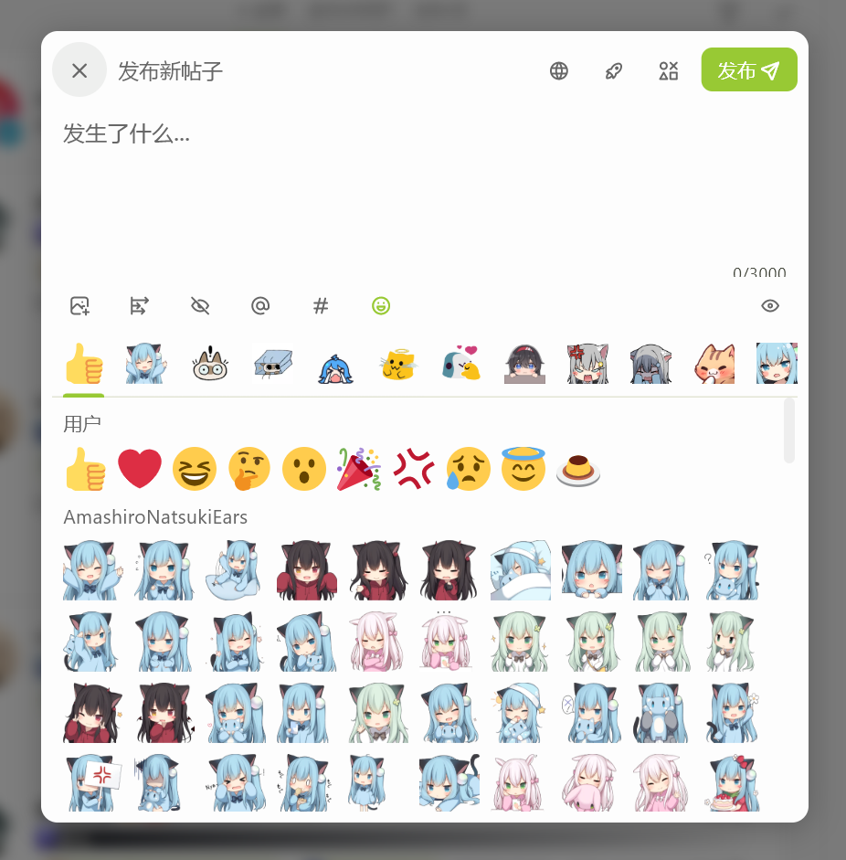

# MoeKey

MoeKey is a misskey client for Flutter  

> This project is currently under development and have many functional deficiencies

## Features
- [x] misskey Servers Selection List 
- [x] misskey Login
- [x] TimeLine
- [x] Drive
- [x] Notifications
- [x] Create,reply and forward Notes
- [x] Streaming Apis
- [x] Compatible with moekey themes file
- [x] Mfm text
- [x] Emoji reactions
- [x] Multi users login
- [ ] I18n
- [ ] User Profile
- [ ] User Widgets
- [ ] Clips
- [ ] Explore
- [ ] Announcements
- [ ] Search
- [ ] User Lists
- [ ] Achievements
- [ ] Channels
- [ ] Firefish Apis
## Screenshot

  

 

 

 

 

 

 

 

## Developers

riverpod code gen
```shell
 dart run build_runner watch --use-polling-watcher
```
